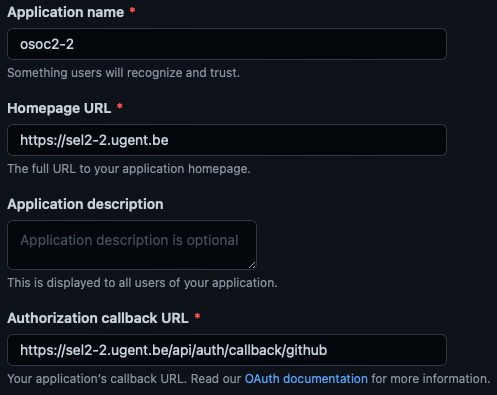

# Deployment Guide

## Server setup
The deployment of the frontend and backend happen on 1 domain name.  
We achieve this by using nginx as a reverse proxy.

The backend can be found back on `*domainname*/api-osoc/`.  
The frontend is can be found back on `*domainname*/`.

In the nginx-config file the following location fields specify this.

```
location / {
    proxy_pass http://localhost:3000/; # frontend can be found back on localhost 3000
}

location /api-osoc/ {
    proxy_pass http://localhost:4096/; # backend can be found back on localhost 4096
}
```

It's also a good idea to redirect `http` to `https`. We achieve this using [certbot](https://certbot.eff.org).  
This is a simple utility that automatically can change your nginx config file to achieve this AND it creates and refreshes the needed TLS certificate.

## Project configuration

### .env files
Next.js supports multiple .env files that have different values depending on the running environment.  
We used the `.env.production`for production and `.env.development` for development.

each of these files should contain following values:

```
NEXT_PUBLIC_API_URL=<insert url to the backend here>
NEXTAUTH_URL=<insert url to the frontend here>
NEXTAUTH_SECRET=<insert next authentication secret here>
GITHUB_ID=<insert github client id here>
GITHUB_SECRET=<insert github client secret here>
```

- for development the first 2 URLs will propably be `http://localhost:xxxx`.
- For development the api url will probably end on `/api-osoc`if you chose the same route as described earlier in the nginx setup.

- The next-auth secret can be generated locally with following command:
```
openssl rand -base64 32
```
- The github id's and secrets are explained [later](#githubOAuth) in this document

### GitHub login
To make github login work it is needed that you make a github OAuth application.  
You can create a new github OAuth app [here](https://github.com/settings/developers)

U can recreate these settings:  


the `Application name` can freely be chosen.
in the `Homepage URL` field you should put the used domain name.
in the `Authorization callback URL`you should replace the first part with your domain name. **Leave the second part of the url untouched (`/api/auth/callback/github`)!**  
<br>
<a name="githubOAuth"></a>
Finally, we only need to update the client id and client secret in the `/frontend/.env.production` file.  
Here you should paste the client ID of the GitHub OAuth application you just made in `GITHUB_ID`.  
In this same file you also need to replace the value of `GITHUB_SECRET`.  
This secret can be generated in the github OAuth application by pressing `Generate a new client secret`.

If you want to run the application locally make another OAuth application and use as homepageUrl `http://localhost:3000`.  
Repeat the same steps once more to change the `GITHUB_ID` and `GITHUB_SECRET` but now in the `/frontend/.env.development`.

## How to deploy

### Preparation
To deploy the server that will host the application needs to have docker installed.  
The installation of docker (docker-compose is not needed) can be found in the [Technical manual](/docs/technicalManual.md)

As we are using an ubuntu server it was also needed that we executed the linux-post install tips.  
A link with information to do this can also be found in the [Technical manual](/docs/technicalManual.md).


### Deployment
<a name="deployment"></a>
1. Install docker & docker-compose on your local machine, also add the server as a remote docker context (see [Technical manual](/docs/technicalManual.md))
2. Make sure you have ssh access to the deployment server. This means that you should start a vpn if this is required for the ssh access,...
3. deploy by executing the command `docker-compose --context remote-server up -d --build` in the root of the project on your local machine.

This last command will push the docker containers to the deployment server via ssh and start the containers.

### Re-deployment
If you want to re-deploy you need to stop and remove the existing containers that are used by the currently out-of-data application that is running on the server.

This can be achieved by running `docker ps` to see the running containers and then run:
- `docker container stop "containerId"`
- `docker container rm "containerId"`
repeat this for the 3 containers used by the osoc selection application.

Listing all the images can be done with `docker images`, then you can delete them with
- `docker rmi "imageId"`

Now you can deploy the new version as described in [Deployment](#deployment)

