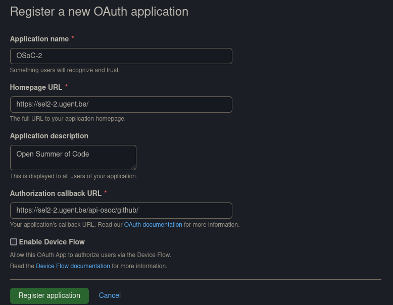
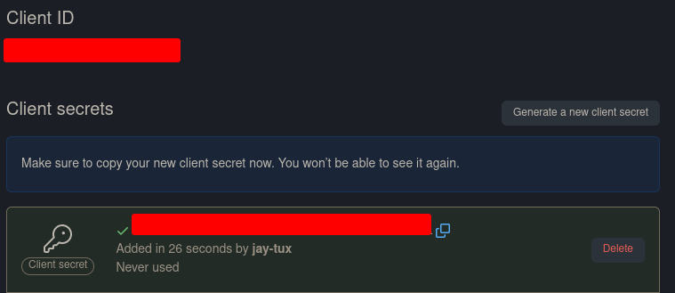

# Deployment Guide

## Server setup
The deployment of the frontend and backend happen on 1 domain name.  
We achieve this by using nginx as a reverse proxy.

The backend can be found back on `*domainname*/api-osoc/`.  
The frontend is can be found back on `*domainname*/`.

In the nginx-config file the following location fields specify this.

```
location / {
    proxy_pass http://localhost:3000/; # frontend can be found back on localhost 3000
}

location /api-osoc/ {
    proxy_pass http://localhost:4096/; # backend can be found back on localhost 4096
}
```

It's also a good idea to redirect `http` to `https`. We achieve this using [certbot](https://certbot.eff.org).  
This is a simple utility that automatically can change your nginx config file to achieve this AND it creates and refreshes the needed TLS certificate.

We also use this server to serve static images (used in the password reset mail).
Following block in the nginx config file achieves this:
```
location /img/ {
    gzip_static on;
    alias <absolute-path-to-where-images-are-located>;
}
```
To make this work you only have to place the logo somewhere on your server and fill in the absolute path to the **folder** where it is located after the `alias`-keyword

## Project configuration
### Frontend

#### .env files
Next.js supports multiple .env files that have different values depending on the running environment.  
We used the `.env.production`for production and `.env.development` for development.

each of these files should contain following values:

```
NEXT_PUBLIC_API_URL=<insert URL to the backend here>
NEXT_PUBLIC_WEBSOCKET_SERVER_URL=<insert URL to your domain here (without specific path to where the backend is on this domain)>
NEXT_PUBLIC_WEBSOCKET_SERVER_PATH=<insert path from the root of your domain name to the socket.io URL>
```
for development the first and second URL will probably be `http://localhost:xxxx`.
For production the second URL is probably almost the same as the first URL, the difference is probably that it's **without** `/api-osoc`at the end
`NEXT_PUBLIC_WEBSOCKET_SERVER_PATH`should be the url to your backend starting from your domain name. With `/socket.io` appended to it.

A small example:
If the complete URL to the backend is `https://someDomain.com/api-osoc` then following values should be used:
```
NEXT_PUBLIC_API_URL=https://someDomain.com/api-osoc
NEXT_PUBLIC_WEBSOCKET_SERVER_URL=https://someDomain.com
NEXT_PUBLIC_WEBSOCKET_SERVER_PATH=/api-osoc/socket.io
```
Notice the `/socket.io` that is appened to `/api-osoc`!
This is needed because the socket connection can be found back on the route `/socket.io` **INSIDE** the backend.

### Backend
#### GitHub login
GitHub login relies on two configurations:
 - One part is on GitHub's servers.
 - The other part relies on .env files in the `/backend/` folder.

##### GitHub part
To enable GitHub login, we need a GitHub application. These are made by going to [GitHub's Developer Applications page](https://github.com/settings/developers). From there, you can click the `New OAuth App` button to create a new application.



You can change the `Application name` to anything you'd like. Be sure to confirm that the `Homepage URL` is correct for your server. The `Application description` can be anything you like. The `Authorization callback URL` should be the `Homepage URL`.

##### Local configuration part
In the `/backend/` folder, add following lines to the `.env.production` and `.env.develoment` files (or create them in `/backend` if they don't exist);
```
GITHUB_CLIENT_ID="<Insert YOUR_CLIENT_ID here>"
GITHUB_SECRET="<Insert YOUR_CLIENT_SECRET here>"
GITHUB_AUTH_CALLBACK_URL="<Insert YOUR_AUTH_CALLBACK here>"
FRONTEND="<Insert URL to your frontend here>"
```

Depending if you are using the development environment or production environment you'll use a different GitHub OAuth application with a different id, secret and callback.
Copy-paste the values from your production OAuth app on GitHub to the `.env.production` file and for development to `.env.development`

You should replace the values with these (see the screenshot below):
 - `YOUR_CLIENT_ID` should be the value given as `Client ID` (the first red box in the screenshot).
 - `YOUR_CLIENT_SECRET` should be the value given below `Client secrets` (the second red box in the screenshot). You can copy this value by clicking the button right next to it.
 - `YOUR_AUTH_CALLBACK` should be the value you filled in for `Authorization callback URL` (from the previous step).
 - The URL to the frontend is not a secret, but we use it here to make this url easily configurable


### Account recovery emails
To send a "password forgotten" email, we use GMail. However, setting this up isn't exactly easy. Please follow along these [steps on medium.com](https://alexb72.medium.com/how-to-send-emails-using-a-nodemailer-gmail-and-oauth2-fe19d66451f9) until you have acquired all 4 codes (client ID, client secret, refresh token and access token).
Once you have them add following lines to the `.env.production` and `.env.development` in `/backend`.
```
GOOGLE_CLIENT_ID="<Insert your google client id here>"
GOOGLE_CLIENT_SECRET="<Insert your google client secret here>"
GOOGLE_REFRESH_TOKEN="<Insert your google refresh token here>"
GOOGLE_ACCESS_TOKEN="<Insert your google access token here>"
```
You might want to create 2 different email accounts for development and production, or you could use the same email account for both.
Just copy-paste the secrets from the development email account to the `.env.development`file and for production to `.env.production`

After that, everything should work out-of-the-box.

## How to deploy

### Preparation
To deploy the server that will host the application needs to have docker installed.  
The installation of docker (docker-compose is not needed) can be found in the [Technical manual](/docs/technicalManual.md)

As we are using an ubuntu server it was also needed that we executed the linux-post install tips.  
A link with information to do this can also be found in the [Technical manual](/docs/technicalManual.md).


### Deployment
<a name="deployment"></a>
1. Install docker & docker-compose on your local machine, also add the server as a remote docker context (see [Technical manual](/docs/technicalManual.md))
2. Make sure you have ssh access to the deployment server. This means that you should start a vpn if this is required for the ssh access,...
3. deploy by executing the command `docker-compose --context remote-server up -d --build` in the root of the project on your local machine.
4. Run ```sudo bash database_backup.sh``` to start the databse backup cron job.

This last command will push the docker containers to the deployment server via ssh and start the containers.

### Re-deployment
If you want to re-deploy you need to stop and remove the existing containers that are used by the currently out-of-data application that is running on the server.

This can be achieved by running `docker ps` to see the running containers and then run:
- `docker container stop "containerId"`
- `docker container rm "containerId"`
repeat this for the 3 containers used by the osoc selection application.

Listing all the images can be done with `docker images`, then you can delete them with
- `docker rmi "imageId"`

Now you can deploy the new version as described in [Deployment](#deployment)
