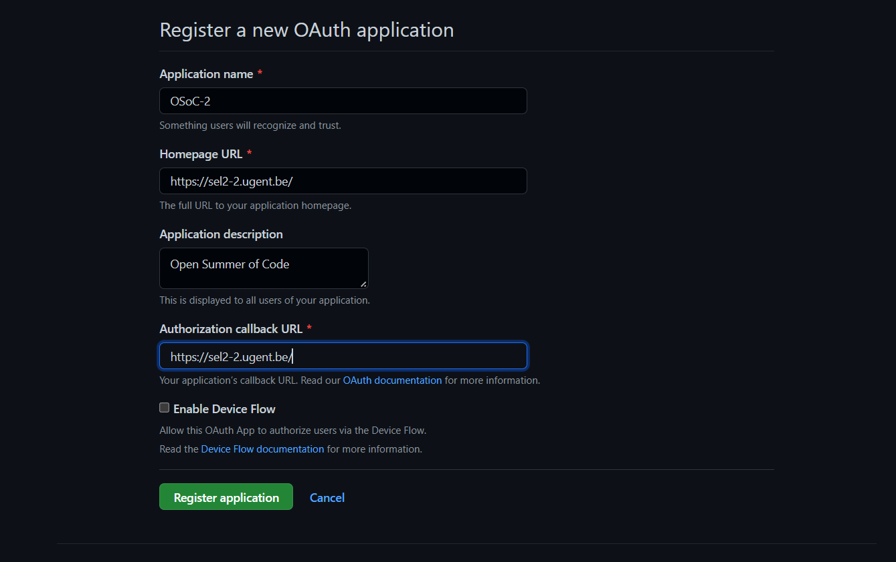

# Deployment Guide

## Server setup
The deployment of the frontend and backend happen on 1 domain name.  
We achieve this by using nginx as a reverse proxy.

The backend can be found back on `*domainname*/api-osoc/`.  
The frontend is can be found back on `*domainname*/`.

In the nginx-config file the following location fields specify this.

```
location / {
    proxy_pass http://localhost:3000/; # frontend can be found back on localhost 3000
}

location /api-osoc/ {
    proxy_pass http://localhost:4096/; # backend can be found back on localhost 4096
}
```

It's also a good idea to redirect `http` to `https`. We achieve this using [certbot](https://certbot.eff.org).  
This is a simple utility that automatically can change your nginx config file to achieve this AND it creates and refreshes the needed TLS certificate.

## Project configuration

### .env files
Next.js supports multiple .env files that have different values depending on the running environment.  
We used the `.env.production`for production and `.env.development` for development.

each of these files should contain following values:

```
NEXT_PUBLIC_API_URL=<insert url to the backend here>
NEXTAUTH_URL=<insert url to the frontend here>
NEXTAUTH_SECRET=<insert next authentication secret here>
GITHUB_ID=<insert github client id here>
GITHUB_SECRET=<insert github client secret here>
```

- for development the first 2 URLs will propably be `http://localhost:xxxx`.
- For development the api url will probably end on `/api-osoc`if you chose the same route as described earlier in the nginx setup.

- The next-auth secret can be generated locally with following command:
```
openssl rand -base64 32
```
- The github id's and secrets are explained [later](#githubOAuth) in this document

### GitHub login
GitHub login relies on two configurations:
 - One part is on GitHub's servers.
 - The other part relies on a config file in the `/backend/` folder.

#### GitHub part
To enable GitHub login, we need a GitHub application. These are made by going to [GitHub's Developer Applications page](https://github.com/settings/developers). From there, you can click the `New OAuth App` button to create a new application.



You can change the `Application name` to anything you'd like. Be sure to confirm that the `Homepage URL` is correct for your server. The `Application description` can be anything you like. The `Authorization callback URL` should be the `Homepage URL`.

#### Configuration part
In the `/backend/` folder, edit the `github.json` configuration file. There are three fields used, and most can be copied straight from the GitHub application you just created:
```json
{
    "client_id": "YOUR_CLIENT_ID",
    "secret": "YOUR_CLIENT_SECRET",
    "auth_callback_url": "YOUR_AUTH_CALLBACK",
    "frontend": "YOUR_SERVER_URL"
}
```

You should replace the values with these (see the screenshot below):
 - `YOUR_CLIENT_ID` should be the value given as `Client ID` (the first red box in the screenshot).
 - `YOUR_CLIENT_SECRET` should be the value given below `Client secrets` (the second red box in the screenshot). You can copy this value by clicking the button right next to it.
 - `YOUR_AUTH_CALLBACK` should be the value you filled in for `Authorization callback URL` (from the previous step).
 - `YOUR_SERVER_URL` is not a value from the secrets, but it should hold the URL of the server on which the frontend runs. 


### Account recovery emails
To send a "password forgotten" email, we use GMail. However setting this up isn't exactly easy. Please follow along these [steps on medium.com](https://alexb72.medium.com/how-to-send-emails-using-a-nodemailer-gmail-and-oauth2-fe19d66451f9) until you have acquired all 4 codes (client ID, client secret, refresh token and access token). Once you have them, create a file called `email.json` in the `/backend/` folder with this structure:
```json
{
    "google-client-id": "CLIENT-ID",
    "google-client-secret": "CLIENT-SECRET",
    "google-refresh-token": "REFRESH-TOKEN",
    "google-access-token": "ACCESS-TOKEN"
}
```
After that, everything should work out-of-the-box.

## How to deploy

### Preparation
To deploy the server that will host the application needs to have docker installed.  
The installation of docker (docker-compose is not needed) can be found in the [Technical manual](/docs/technicalManual.md)

As we are using an ubuntu server it was also needed that we executed the linux-post install tips.  
A link with information to do this can also be found in the [Technical manual](/docs/technicalManual.md).


### Deployment
<a name="deployment"></a>
1. Install docker & docker-compose on your local machine, also add the server as a remote docker context (see [Technical manual](/docs/technicalManual.md))
2. Make sure you have ssh access to the deployment server. This means that you should start a vpn if this is required for the ssh access,...
3. deploy by executing the command `docker-compose --context remote-server up -d --build` in the root of the project on your local machine.

This last command will push the docker containers to the deployment server via ssh and start the containers.

### Re-deployment
If you want to re-deploy you need to stop and remove the existing containers that are used by the currently out-of-data application that is running on the server.

This can be achieved by running `docker ps` to see the running containers and then run:
- `docker container stop "containerId"`
- `docker container rm "containerId"`
repeat this for the 3 containers used by the osoc selection application.

Listing all the images can be done with `docker images`, then you can delete them with
- `docker rmi "imageId"`

Now you can deploy the new version as described in [Deployment](#deployment)
